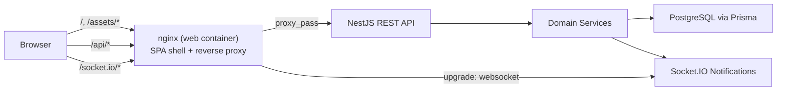

# Food Delivery


Full-stack food delivery platform — NestJS REST API, React SPA, real-time order tracking, Dockerized deployment, and a comprehensive test/CI pipeline.

## About

This is a production-grade food delivery application built as a portfolio project. Customers browse restaurant menus, build a cart, and place orders with custom tips and coupon discounts. Restaurant owners manage menus, coupons, and order fulfillment through a dedicated dashboard. Both sides receive real-time status updates via Socket.IO.

Key highlights:

- Integer-cents money handling end-to-end (no float drift)
- Order status state machine with forward-only transitions
- Snapshotted order items for immutable order history
- OpenAPI-driven typed API client with CI drift detection
- Same-origin web topology (nginx reverse proxy, relative URLs only)
- Layered testing: unit, integration (Testcontainers), API e2e, web (MSW), Playwright smoke

For architecture deep-dives, design trade-offs, and a suggested demo flow, see [ARCHITECTURE.md](ARCHITECTURE.md).

## Stack

- **API:** NestJS, Prisma, PostgreSQL, REST, OpenAPI, Socket.IO notifications
- **Web:** React 19, Vite, MUI v7, TanStack Query, Zustand, React Router v7 (data router)
- **Quality:** strict TypeScript, layered validation, typed domain errors, unit/integration/e2e tests
- **DevOps:** pnpm monorepo, Docker Compose, GitHub Actions

## Architecture



The web container is the single front door. It serves the SPA, reverse-proxies
`/api/` and `/socket.io/` to the API, and emits a strict CSP plus the usual
hardening headers. The bundle uses **relative URLs only** — there is no
`VITE_API_URL` / `VITE_WS_URL` env contract and no `apiConfig.baseUrl`, which
means the same image deploys to any host that proxies the API. Local `pnpm dev` mirrors this with the Vite dev proxy, so dev and prod behave the same.

## Getting Started

### Local development (default)

```bash
fnm use 24
corepack enable
pnpm install
cp .env.example .env

docker compose up -d           # postgres (dev infra)
pnpm db:migrate
pnpm db:seed                   # optional; demo data
pnpm dev                       # api + web (HMR)
```

Open `http://localhost:5173`. The Vite proxy forwards `/api` and `/socket.io`
to the local api on `:3000`, mirroring the prod nginx topology so dev and prod
behave the same (ADR 0005).

Customer flow: browse restaurants → open meal details → add meals to cart → checkout → track orders and status timeline at `/orders/:orderId`.

Owner flow: sign in as `owner@example.com` → open **Dashboard** in the nav → manage restaurants, meals, coupons, and blocked customers → advance orders from `/orders/:orderId`.

For a concise demo script, architecture talking points, and validation
commands, see [ARCHITECTURE.md](ARCHITECTURE.md).

### Bundled prod-shape stack (local validation / demo)

```bash
docker compose -f compose.prod.yaml up --build
```

Starts the prod-built api image + nginx-served SPA + postgres. Use this for
the live demo, validating the same-origin topology, or reproducing a
prod-shape bug locally. `SEED_DATABASE=false docker compose -f compose.prod.yaml up --build`
skips demo data.

Only the web container publishes a host port (`5173:8080`; nginx runs
unprivileged and listens on `8080` inside the container). The same-origin
invariant (ADR 0005) means everything — SPA, REST API, websocket transport,
Swagger — is reached through that single origin:

- Web app: `http://localhost:5173`
- API docs: `http://localhost:5173/docs`
- Health: `http://localhost:5173/health/ready`

Swagger UI is served by default for the demo. Set `ENABLE_SWAGGER=false` to
disable `/docs` (and `/docs-json`) in environments where the API contract
should not be publicly browsable.

To smoke-test the bundled stack instead of the dev server:

```bash
PLAYWRIGHT_BASE_URL=http://localhost:5173 pnpm test:smoke
```

### Deploy reality

`compose.prod.yaml` is the **reference local stack**, not a production deployer.
Real production runs the **same images** CI builds (see
[`.github/workflows/ci.yml`](.github/workflows/ci.yml)) inside an orchestrator
(Kubernetes / ECS / Fly / Render / etc.) — operator's choice. The repo's
responsibility ends at building, testing, and producing deployable container images.

### Dev vs deploy at a glance

- **Process model:** dev runs api + web as host Node processes; deploy runs them as containers from `apps/api/Dockerfile` and `apps/web/Dockerfile`.
- **Front door:** dev = Vite dev server with proxy; deploy = nginx reverse-proxy with strict CSP (ADR 0005).
- **NODE_ENV:** dev = `development`; deploy = `production`.
- **Migrations:** dev = manual `pnpm db:migrate`; deploy = api entrypoint runs `prisma migrate deploy`.
- **Seeding:** dev = manual `pnpm db:seed`; deploy = controlled by `SEED_DATABASE`; refused in production unless `ALLOW_PROD_SEED=true`.
- **Logging:** dev = pretty-printed pino; deploy = JSON.
- **Same-origin invariant:** dev preserves it via the Vite proxy; deploy preserves it via nginx. The bundle never embeds a host either way.

### Demo credentials

Use the **theme toggle** in the app header (sun / moon / auto icon) to switch between light, dark, and system appearance.

The seed script creates the primary demo owner/customer plus two secondary
customers used to make owner-side order history and block-candidate flows feel
realistic:

| Role               | Email                      | Password       | Demo use                                                      |
| ------------------ | -------------------------- | -------------- | ------------------------------------------------------------- |
| Owner              | `owner@example.com`        | `Password123!` | Owner dashboard, menu/coupon management, order fulfillment    |
| Primary customer   | `customer@example.com`     | `Password123!` | Customer walkthrough; most seeded orders live under this user |
| Secondary customer | `avery.chen@example.com`   | `Password123!` | Extra owner-side order history / block-candidate data         |
| Secondary customer | `marcus.patel@example.com` | `Password123!` | Extra completed order history / block-candidate data          |

Health probes (no auth, outside `/api` prefix):

- `GET /health/live` – process liveness
- `GET /health/ready` – readiness including PostgreSQL connectivity

## Validation Strategy

Validation is layered deliberately:

1. Generated TypeScript types from OpenAPI keep the frontend and backend contract aligned.
2. DTO validation rejects malformed input at the API boundary.
3. Guards enforce authentication, roles, and resource ownership.
4. Domain services enforce business invariants like one restaurant per order, legal status transitions, and block checks.
5. PostgreSQL constraints protect persisted integrity.
6. Frontend form validation improves UX, but the API remains the source of truth.

## Testing Strategy

- Unit tests cover pure logic: pricing, coupons, and order status transitions.
- Integration tests run services against real PostgreSQL.
- API e2e tests exercise auth lifecycle, refresh rotation, RBAC/resource guards, OpenAPI shape, realtime flows, and error serialization.
- Realtime tests verify Socket.IO authentication, per-user isolation, and owner-scoped order events.
- Frontend unit tests cover forms, cart money invariants, order role matrix, owner flows, and notification cache invalidation with MSW.
- CI runs lint, typecheck, unit/web-test (with enforced coverage thresholds), integration, API e2e, OpenAPI drift check, and build.

## Design Decisions and Trade-offs

These are intentional choices, kept short on purpose:

- **Money is integer cents end-to-end.** No `parseFloat`, no `Decimal`. Display formatting happens at the UI edge via `formatCents`.
- **Order status is a state machine.** All transitions go through `OrderStatusMachine.canTransition`; status events are written in the same transaction.
- **Order items are snapshotted.** `nameSnapshot` and `priceCentsSnapshot` make historical orders immutable. `duplicate` rebuilds from current prices and drops inactive meals, and is allowed only for completed (`RECEIVED`) orders.
- **Single restaurant per order.** Enforced server-side in `OrdersService.place` and client-side in the cart store.
- **JWT access + opaque rotating refresh.** Bearer for any client; refresh tokens stored hashed, `@@unique([tokenHash])`, and consumed atomically via a single `updateMany` so two concurrent refresh requests can never both succeed.
- **In-process EventEmitter into a Socket.IO gateway.** Simple and easy to demo; documented scale path is a Redis adapter or message bus. The gateway only accepts the origins listed in `WEB_ORIGIN` (single canonical origin in production, optionally a comma-separated allowlist in dev/staging for LAN device testing) so direct API connections from other origins are rejected.
- **Typed errors only.** Domain errors carry stable `code`s and a global filter renders `application/problem+json`. Even pricing helpers (`cents`, `discountCents`, `computePricing`) throw `DomainError` subclasses with the `INVALID_PRICING_INPUT` code, never untyped `RangeError`.
- **Restaurants are not deletable.** FK-`Restrict` from orders means historical orders never lose their restaurant. Owners edit metadata; meals and coupons deactivate. Public meal listing returns active meals only; owners use `GET /restaurants/:restaurantId/meals/all` for full management.
- **OpenAPI is the contract.** `packages/api-client` is generated from the API's OpenAPI document. Optional query params are flagged with `@ApiQuery({ required: false })` so the generated types match reality.
- **Same-origin web topology.** The web nginx reverse-proxies `/api/` and `/socket.io/`. The bundle calls relative URLs and never embeds the API host — there is no `VITE_API_URL` / `VITE_WS_URL` env contract.
- **Data router with feature query factories.** React Router v7 `createBrowserRouter`. Auth and role guards run in route loaders, each feature owns `features/<name>/queries.ts` exporting `<feature>Keys` + `queryOptions(...)` factories, and loaders prefetch via `queryClient.ensureQueryData(featureQuery(...))`. Components use the same factories. `errorElement` renders typed `ApiError` problem details with a real 404 page for unknown routes.

## Auth upgrade note

Refresh tokens are issued as an **HttpOnly, SameSite=Lax cookie** scoped to `/api/v1/auth`. The access token lives in memory only (not `localStorage`). Previously issued refresh tokens in local storage are no longer valid — sign in again after upgrading. See [docs/adr/0004-httponly-cookie.md](docs/adr/0004-httponly-cookie.md).

## Out of Scope

The following are explicitly not built:

- Payment processing
- Search ranking, geolocation, ETA
- Admin panel (the `UserRole` enum leaves room for `ADMIN` later)
- Native mobile app (the API supports mobile clients via Bearer; the deliverable UI is the web app)

## Requirements coverage

Every product requirement maps to implementation and tests:

| Requirement                            | Implementation                                                         | Test                                                                                           |
| -------------------------------------- | ---------------------------------------------------------------------- | ---------------------------------------------------------------------------------------------- |
| REST API usable by multiple front ends | OpenAPI at `/docs`, generated `@food-delivery/api-client`              | `apps/api/test/app.e2e-spec.ts` (OpenAPI drift in CI)                                          |
| Create account / log in                | `apps/api/src/modules/auth/`                                           | `apps/api/test/app.e2e-spec.ts` (signup + refresh rotation)                                    |
| One account per email                  | `User.email @unique` in `schema.prisma`                                | `apps/api/src/modules/users/users.service.ts` → `RegistrationFailedError`                      |
| Restaurant `{name, description}`       | `apps/api/src/modules/restaurants/`                                    | `apps/web/src/features/owner/OwnerDashboardPage.spec.tsx`                                      |
| Meal `{name, description, price}`      | `apps/api/src/modules/meals/`                                          | Owner dashboard meal CRUD spec                                                                 |
| Order `{items, date, total, status}`   | `apps/api/src/modules/orders/`                                         | Core e2e workflow in `app.e2e-spec.ts`                                                         |
| Single restaurant per order            | `OrdersService.place` + cart store                                     | `apps/web/src/features/cart/cart.store.spec.ts`                                                |
| Custom tip + coupon discount           | `computePricing` + `CartPage`                                          | `apps/api/src/modules/orders/domain/pricing.spec.ts`                                           |
| No payment handling                    | Not implemented (see Out of Scope)                                     | —                                                                                              |
| Status flow + role permissions         | `order-status-machine.ts`                                              | Full matrix in `order-status-machine.spec.ts` + `OrderDetailPage.spec.tsx`                     |
| Forward-only status (no rollback)      | `canTransition` terminal + next-step rules                             | State-machine unit tests                                                                       |
| Real-time status notifications         | `NotificationsProvider` + Socket.IO gateway                            | `NotificationsProvider.spec.tsx` + realtime e2e                                                |
| Status change history with timestamps  | `OrderStatusEvent` + timeline UI                                       | Events endpoint in core e2e                                                                    |
| Duplicate previous order from history  | `POST /orders/:id/duplicate` + **Reorder** (completed orders only)     | `OrdersPage.spec.tsx` + duplicate e2e                                                          |
| Customers and owners list orders       | `GET /orders` (role-scoped)                                            | `OrdersPage` + owner filter e2e                                                                |
| Owner blocks a user                    | `blocks` module + owner dashboard                                      | Block/candidate e2e + `OwnerDashboardPage.spec.tsx`                                            |
| MUI web application                    | `apps/web/` (React + MUI v7)                                           | Playwright smoke `tests/smoke/happy-path.spec.ts`                                              |
| Professional UI / cover imagery        | Optional `imageUrl` on restaurants & meals, `CoverImage`, landing page | `LandingPage.spec.tsx`, `RestaurantsPage.spec.tsx`, [ADR 0008](docs/adr/0008-cover-imagery.md) |
