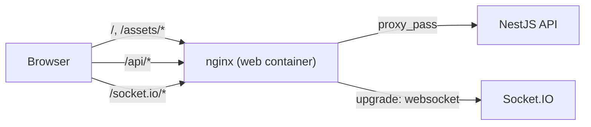

# 5. Same-origin web topology

- **Status:** Accepted
- **Date:** 2026-05-29
- **Deciders:** Tyler Fletcher
- **Tags:** topology, web, nginx, deployment

## Context and Problem Statement

Early in the project the web bundle was configured with `VITE_API_URL` and
`VITE_WS_URL` env vars and the SPA called the API across origins. That
shape forced us into permissive CORS on the API, complicated cookie scoping
for the refresh-token cookie (ADR 0004), and tied every deploy environment
to a build-time URL — which broke the "build once, deploy anywhere"
invariant for container images.

We want a single deploy artifact that can be promoted from staging to
production, behind whatever ingress the platform provides, without rebuilding
the JS bundle.

## Decision Drivers

- One build, many environments. The web image must not embed a hostname.
- No CORS surface on the API for browsers. CORS should exist only as a
  defense-in-depth lock on the realtime gateway.
- The refresh-token cookie (ADR 0004) needs first-party semantics, which
  requires the SPA and API to share an origin.
- Local dev should behave identically to production so issues surface early.

## Considered Options

1. **The web container's nginx serves the SPA and reverse-proxies `/api/`
   and `/socket.io/` to the API; the bundle uses relative URLs only.**
2. Separate web/API origins with permissive CORS and CORS-friendly cookies.
3. BFF service (Node, Go) that both serves the SPA and proxies the API.
4. Cloud-specific ingress rule (e.g. ALB path-based routing) doing the same
   path-split, with a separate web bucket.

## Decision Outcome

Chosen option **1: nginx in the web container is the single front door**.

- The web bundle calls relative URLs only. There is no `VITE_API_URL` /
  `VITE_WS_URL`. There is no `apiConfig.baseUrl`. ESLint flags any
  reintroduction.
- Nginx uses Docker's embedded DNS (`resolver 127.0.0.11`) with a variable
  in `proxy_pass`, so the API hostname is re-resolved at runtime and the web
  container survives API restarts that get a new IP.
- Nginx emits a strict CSP plus the usual security headers, and the
  `connect-src 'self'` directive only works because of the same-origin
  topology.
- Local `pnpm dev` mirrors this with the Vite dev proxy, so dev and prod
  behave the same.
- The API's CORS configuration only permits the origins listed in
  `WEB_ORIGIN` on the Socket.IO gateway — a belt-and-suspenders lock that
  does not affect normal traffic, which never crosses origins. Production
  should use a single canonical origin; local development may list multiple
  comma-separated origins for LAN device testing.

## Consequences

### Positive

- One Docker image promotes from staging to production without rebuild.
- Refresh-token cookie is first-party and scope-limited (`/api/v1/auth`).
- No CORS preflight overhead on data requests.
- CSP can be strict without the `connect-src` carve-outs that a separated
  origin would require.

### Negative / Trade-offs

- A second hop (browser → nginx → API) at slightly higher latency than
  direct browser → API.
- The web container becomes the failure boundary for the SPA. We accept this
  because the API and web containers usually fail together (deploys are
  coordinated).
- Any change to the API's URL prefix (`/api/v1`) requires updating both the
  nginx proxy and the refresh-cookie path in lockstep.

## Validation

- `apps/web/nginx.conf` — reverse-proxy config with strict CSP.
- `apps/web/vite.config.ts` — dev proxy mirroring nginx so dev and prod
  behave the same.
- `apps/web/eslint.config.mjs` — `no-restricted-imports` forbids
  reintroducing `VITE_API_URL` / `VITE_WS_URL` use.
